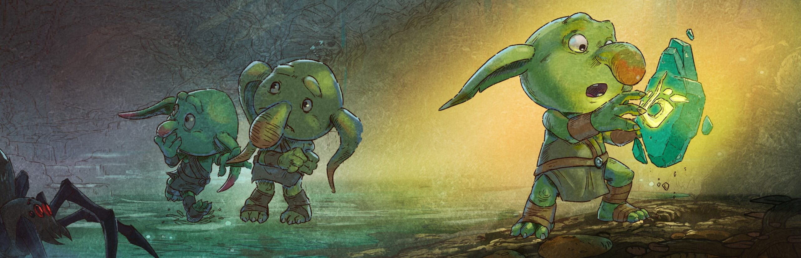

<h1>Edlen Jay Jareta</h1>

Hey there! I’m Edlen — a <b>QA Game Tester</b> who loves diving into games to break them before players can. With hands-on experience testing across PC and mobile platforms, I focus on gameplay mechanics, UI, and performance to make every gaming experience bug-free and fun. Testing is my game, and quality is my win condition.
  

<h2>My Work Experience</h2>

<table>
  <tr>
    <td width="130" align="center" style="vertical-align: middle; padding-right: 20px;">
      
    </td>
    <td style="vertical-align: middle;">
      <b>Quality Assurance –</b> <strong>H.P.L. Game Design</strong> 
      
          I worked as a Quality Assurance Game Tester, collaborating with the QA and Development teams to make sure every build delivered the best gameplay experience possible. 
          I handled manual testing, bug reporting, and test case execution, while also helping maintain QA documentation. 
          My work included running regression, smoke, and acceptance tests to keep the games stable and fun to play across different platforms.
      
    </td>
  </tr>

  <tr><td colspan="2"> </td></tr> <!-- spacer row -->

  <tr>
    <td width="130" align="center" style="vertical-align: middle; padding-right: 20px;">
      
    </td>
    <td style="vertical-align: middle;">
      <b>Quality Assurance –</b> <strong>Orc Chop Games Inc.</strong> 
      
          I worked as a Quality Assurance Game Tester, collaborating closely with the QA Lead and Development team to ensure a smooth and balanced gameplay experience. 
          I performed playtesting, executed detailed test cases covering gameplay mechanics, UI, character abilities, and damage calculations, and reported bugs using tools like Asana and Jira. 
          I also prepared reports for smoke and regression testing to help track progress and maintain game stability throughout development.
      
    </td>
  </tr>
</table>
 

  

<h2 align="center">Goblin Stone</h2>

  Goblin Stone puts you in charge of the last goblins trying to survive a world that hunts them. 
  Rebuild the lair, raise your numbers, and lead expeditions in a heartwarming turn-based roguelite where every decision matters.  
  🎮 <a href="https://store.steampowered.com/app/1521970/Goblin_Stone/" target="_blank"><b>Wishlist or Play Goblin Stone on Steam</b></a>

  
<h2>Tools</h2>

  <table style="width: 90%; border-collapse: collapse;">
    <tr>
      <th align="left" style="padding: 10px; width: 30%;">Category</th>
      <th align="left" style="padding: 10px; width: 70%;">Tools</th>
    </tr>
    <tr>
      <td style="padding: 10px; vertical-align: top;"><b>Project Management</b></td>
      <td style="padding: 10px;">Jira, Notion</td>
    </tr>
    <tr>
      <td style="padding: 10px; vertical-align: top;"><b>Defect Tracking</b></td>
      <td style="padding: 10px;">Asana, Jira</td>
    </tr>
    <tr>
      <td style="padding: 10px; vertical-align: top;"><b>Others</b></td>
      <td style="padding: 10px;">Google Suite</td>
    </tr>
  </table>

I utilize a range of tools that enhance efficiency and collaboration throughout the QA process. 
<strong>Jira</strong> and <strong>Notion</strong> streamline project management, task tracking, and sprint coordination with development teams. 
For <strong>defect tracking</strong>, <strong>Asana</strong> and <strong>Jira</strong> ensure clear bug documentation, prioritization, and fast issue resolution. 
Meanwhile, <strong>Google Suite</strong> supports test documentation, reporting, and communication—keeping workflows organized and teams aligned for smoother game development cycles.

  
<h2>Certificates</h2>

  <table style="width: 90%; border-collapse: collapse;">
    <tr>
      <th align="left" style="padding: 10px;">Certificate</th>
      <th align="left" style="padding: 10px;">Platform</th>
      <th align="left" style="padding: 10px;">Link</th>
    </tr>
    <tr>
      <td style="padding: 10px;">Unit Testing for C# Developers</td>
      <td style="padding: 10px;">Udemy</td>
      <td style="padding: 10px;">
        <a href="https://www.udemy.com/certificate/UC-40f0640b-1175-45bb-8a50-cfcccaaba1b6/" target="_blank">View Certificate</a>
      </td>
    </tr>
    <tr>
      <td style="padding: 10px;">Software Testing: Effective Test Case Writing and Formatting</td>
      <td style="padding: 10px;">Udemy</td>
      <td style="padding: 10px;">
        <a href="https://www.udemy.com/certificate/UC-ac711320-4d90-412d-ab99-18d0eaebe1a6/" target="_blank">View Certificate</a>
      </td>
    </tr>
    <tr>
      <td style="padding: 10px;">Unit Testing for Unity 6 and C#</td>
      <td style="padding: 10px;">Udemy</td>
      <td style="padding: 10px;">
        <a href="https://www.udemy.com/certificate/UC-3f19c63f-6067-4041-81f8-ffdb86845a55/" target="_blank">View Certificate</a>
      </td>
    </tr>
  </table>

